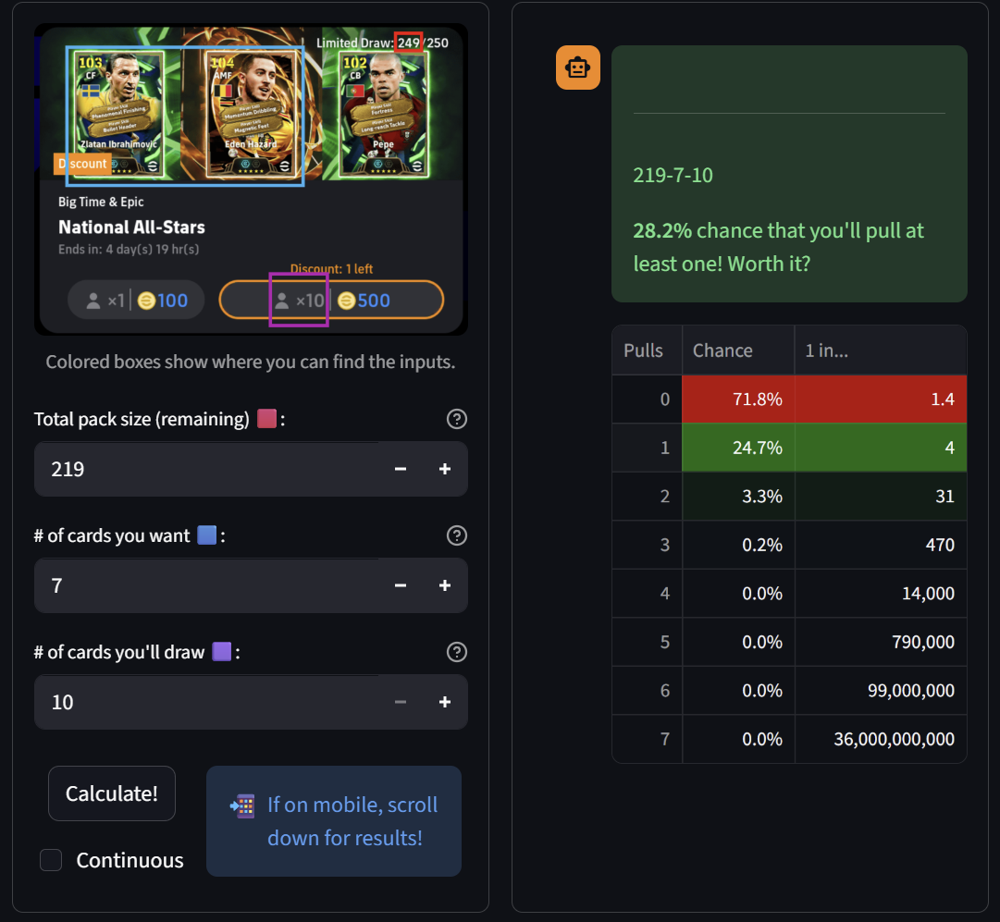
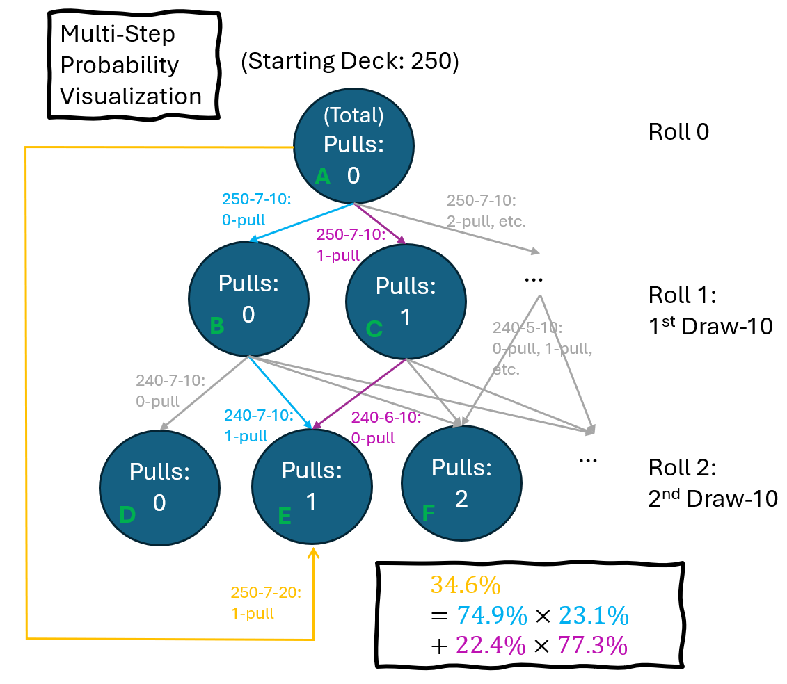
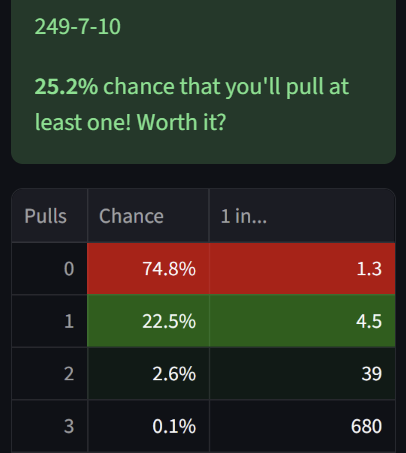

# packprob: eFootball Pack Probability Calculator <!-- omit from toc -->
### ⚡ LIVE NOW AT <https://packprob.streamlit.app>

Calculate the probability of *actually* getting the player(s) you want from an eFootball pack draw! Yeah, it'll be less than you think...


eFootball is a free-to-play (F2P) video game subsisting on the **gacha** mechanic of spending "coins" to draw soccer player cards from fixed release packs.

> **The problem**: Since the pack is finite and players are drawn without replacement, it is tempting to imagine that you can get what you want as long as you *keep drawing*. But just like in Blackjack (where you can technically double your lost bet and expect to recover)... **how long can you afford to keep drawing**? Mental intuition won't work when packs vary in size from 50 to 250 and contain 1 to 7 headliners!

> **The solution**: Bump up "cards you'll draw" on **packprob** until you see chances you like - that's what you'll need to budget. Ahead of time, see what an extra draw does (or *doesn't*) for your chances - no more sunk-cost fallacy pushing you for "one more spin" ($10 btw) in the heat of the moment.

Life is hard, gambling is harder. We owe it to ourselves (and to the literal children playing this game) to facilitate better choices. Here, that boils down to understanding a classic problem: drawing playing cards from a deck. Maybe I can learn math, practice GUI design, and contribute to a community I love all at the same time?

### Table of Contents

- [Example 1: Normal use case](#example-1-normal-use-case)
  - [Extension: Budgeting](#extension-budgeting)
  - [Extension: One more draw?](#extension-one-more-draw)
  - [Extension: Multi-step probability](#extension-multi-step-probability)
- [Example 2: Using packprob to analyze your luck](#example-2-using-packprob-to-analyze-your-luck)
- [How it works (AKA The Math)](#how-it-works-aka-the-math)
  - [Extension: $x$ desired cards](#extension-x-desired-cards)
- [Function Usage (API)](#function-usage-api)

<!-- ## Example 0: An intuitive case

**Scenario**: "It's a 150-player pack with 1 BigTime and 2 ShowTimes. I really want the BigTime, and I'm willing to roll 5 draws of 10 players each (spending 5*900=4500 coins)."

**Usage**: `epic_chance(150, 1, 5*10)`

**Output**: `{0: 0.6666666666666666,
          1: 0.3333333333333333}`

> **33.3%** chance that you'll get something you want (i.e. avoid X=0)! Worth it?  
Here's the rest of the picture - chances of getting each number of desired players (e.g. epics) during this draw:  
0: 66.7%  
1: 33.3% -->

## Example 1: Normal use case

, drawing 10 by paying coins.")

**Scenario**: "It's a 250-player pack with 7 epics. I just started playing so would be happy with 
            any of the 7. I just saved up 900 coins so can only roll once for 10 players! Konami 
            did already give us 1 free chance, but I didn't get anything with that (obviously)."

*(Yes, this is the reference screenshot I included in the app. It is the National All-Stars campaign from 2026-04.)*

**Usage**: 


**Analysis**: 

**25.2%** chance - about **1 in 4** (or 0.3 in 1.3 if you take the complement of the 0-pull) - of pulling an epic after dropping your entire savings isn't *great*, but it's certainly not nothing! 

From the table, we can also see that the 25.2% consists of 22.5% chance of pulling exactly 1 epic and a 2.6% chance - 1 in 39 - of pulling 2. That was surprising to me personally - 1 in 4 for pulling anything feels low, but 1 in 40 for pulling 2 when only drawing 10 total feels high!

### Extension: Budgeting

Now suppose we have way more coins - let's simulate drawing more cards. Click the `+` on `# of cards you'll draw`. We'll skip the screenshot - the GIF in the intro actually already shows this! 

Did you notice how the table turned greener with each click? Try it for yourself - at `249-7-30`, you'll see a ~60% chance of pulling, including ~40% for pulling 1, 16% chance for pulling 2, and 3.5% chance for pulling 3. You might think to yourself, "Drawing 30 costs $3 \times 900 = 2700$ coins, and I'm *more likely than not* to get something. Let's have a go."

### Extension: One more draw?

Ah, you had a go. Fully clear-headed, 3 rolls, and yet you still ended up in the 0-pull outcome universe where you got nothing. Just bad luck. What now?

packprob still has your back. To see what another draw will do for you, click `-` 3 times on `pack size remaining`, and reset `cards you'll draw` back to 10: 



Hahahaha. Even with 30 fewer cards left in the deck, your draw-10 chance has **only increased from 25% to 28%**. In other words, still 1 in 4 chance if you go again. That should be surprising to most people - sunk-cost fallacy would have us thinking that giving up now is throwing away *everything we've built*. But we've only "built" 3%.

### Extension: Multi-step probability

But wait! you say. Focusing on the 1-pull line of the table (I just want 1 epic, please!): `249-7-40` showed 40%, but `219-7-10` shows only 25%. I'm about to be 40 cards deep, and I haven't gotten my 1 pull. **Why is it now saying 25% - I want my 40%!**

Understandable; let's think through **multi-step probability**. Before you rolled down the path to your bad luck 0-pull outcome universe, there were many other paths towards the outcome of "exactly 1 pull, drawing 40". For example, the path where you pulled 1 in the first 10, then 0 in the second 10, then 0 in the third 10, then 0 in the fourth. Or the path where you pulled 0, then 0, then 1, then 0. Or...

Ah! you say. So **from my current outcome universe** (0-then-0-then-0), I have **fewer paths** (only 1 path in this case: to pull 1 in the next draw) that can reach the originally-targeted outcome. So my 15% from the other paths no longer applies... wait, are you freehanding a graph in PowerPoint?



I drew a simpler scenario than discussed to avoid another level of outcome nodes and the accompanying edges, but the idea is the same. Yes, you originally had a 35% chance to go from A to E, but if you're already now standing at B, you have only a 23% chance of fulfilling in the next roll (outcome E), and you're waaay more likely (the other 77%) to end up in D!

## Example 2: Using packprob to analyze your luck


**Scenario**: "Woah, I just pulled BigTime Hazard AND epic Sneijder in my first 10-draw! I must be the 
            luckiest person on the planet - I wonder what were the chances of pulling 2 epics including 
            Hazard? It was a 250-pack (with a free chance) that had 7 epics including the BigTime."

**Analysis**: This actually happened to me lol. We start by calculating the chance of pulling any 2 epics:



So that's a 2.6% (~1 in 39) chance to start. But we were luckier than that - how many of these 
epic 2-combos include Hazard specifically? There are *7-choose-2* $\binom{7}{2}=21$ total combos, 6 of which include 
Hazard (just fix Hazard and then cycle through the other 6). That's a 2/7 chance on top of the 
2.59% - multiplying for concurrency we get **0.74%**, or **1 in 135**!

**Answer**: So I am very lucky, but not the luckiest in the world! On average, 1 in every 135 players who 
        drew 10 experienced the same unforgettable Big Time double walkout animation. And as we know, 
        there are more than one million "serious" players competing in Divisions on mobile - if 1 million 
        went for the pack, then we'd estimate $\frac{1e6}{135} \approx 7407$ people had the same luck.

## How it works (AKA The Math)

Let's go back to our scenario in Example 1 - 249 cards left in the pack, 7 desired, drawing 10. 

We can frame our curiosity on bad luck as: "how many ways are there to draw 10, and all 10 end up being from the 249-7=242 cards that we *don't* want?" 

Well, that's not too hard - that's just 242-choose-10, $\binom{242}{10}=157,237,259,217,593,698$. Okay that's a lot of ways, but you have to consider it in relation to aaaaalll the ways you can draw 10, i.e. 249-choose-10, $\binom{249}{10}$, which is even bigger than that (I won't write it out). The probability then, of ending up in one of those horrible universes with 0 desired cards within the space of all universes, is...

```math 
\frac{\binom{242}{10}}{\binom{249}{10}} \approx 0.748 = 74.8\%
```

and from that we know the complement - 25.2% - is the chance of getting $\geq 1$ desired cards! This checks out with Example 1.

### Extension: $x$ desired cards

"What about getting $x$ desired cards exactly?" you say. "We'd probably need to account for all ways to draw $x$ from the 7 desireds, and also all ways to draw the other $10-x$ from the 242 undesireds, right?" Yup, framing the question right makes probability easy:

$$ \frac{\binom{7}{x} \binom{242}{10-x}}{\binom{249}{10}} $$

and for $x=2$, we have 

```math 
\frac{\binom{7}{2} \binom{242}{8}}{\binom{249}{10}} \approx 0.0259 \approx 2.6\% 
```

which again checks out with Example 1!

## Function Usage (API)

This project is really just one function called `epic_chance()`; I hooked it up to a Streamlit framework front-end to turn it into the web app (my first time playing with web design!). I also planned to hook it into an offline executable app (maybe using Tkinter) - let me know if there's any desire for that?

`epic_chance()` is in `src.py`, in case you ever want to import it. Let's run through Example 1 (249 cards left in the pack, 7 desired, drawing 10) without the web GUI:

**Usage**: `epic_chance(250-1, 7, 1*10)`

**Output**: `{0: 0.7478759630652251,
          1: 0.22468376572775,
          2: 0.025925049891663464,
          3: 0.0014709248165482817,
          4: 4.362912591456768e-05,
          5: 6.627208999681165e-07,
          6: 4.640902660841153e-09,
          7: 1.109600158001471e-11}`

If you left `verbose=True`, then you'll also get the following explanation printed to console:

> ----  
> 249-7-10  
**25.2%** chance that you'll pull at least one! Worth it?  
Here's the rest of the picture - **chance** of getting each number of **desired** cards (e.g. epic players) while drawing:  
0 pulls: **74.8%**  
1 pulls: **22.5%**  
2 pulls: **2.6%**  
3 pulls: **0.1%**  
4 pulls: **0.0%**  
5 pulls: **0.0%**  
6 pulls: **0.0%**  
7 pulls: **0.0%**

If random variable $X$ is the number of desired cards pulled in the given draw scenario, then the output Python dictionary is the mapping of 

$$ x: Pr[X=x]. $$

Observe that $1-Pr[X=0]$ (1 minus `output[0]`) is the chance you'll get *something*, and that's what prints the 25.2%.
