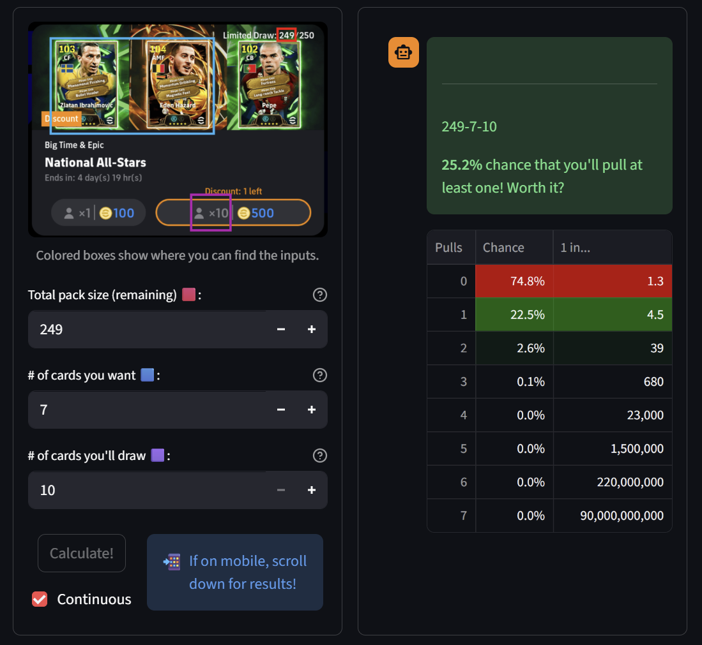

# packprob: eFootball Pack Probability Calculator <!-- omit from toc -->
### ⚡ LIVE NOW AT <https://packprob.streamlit.app>

Calculate the probability of *actually* getting the player(s) you want from an eFootball pack draw! Yeah, it'll be less than you think...


eFootball is a free-to-play (F2P) video game subsisting on the **gacha** mechanic of spending "coins" to draw soccer player cards from fixed release packs.

> **The problem**: Since the pack is finite and players are drawn without replacement, it is tempting to imagine that you can get what you want as long as you *keep drawing*. But just like in Blackjack (where you can technically double your bet and expect to recover)... **how long can you afford to keep drawing**? Mental intuition won't work when packs vary in size from 50 to 250 and contain 1 to 7 headliners!

> **The solution**: Bump up "cards you'll draw" on **packprob** until you see chances you like - that's what you'll need to budget. Figure it out ahead of time - no more sunk-cost fallacy pushing you for "one more spin" (that's $10 btw).

We're all gambling some way or other, so we should probably know all the probabilities, all the time. Here, that boils down to the classic "drawing playing cards from a deck". Maybe I can learn math, practice GUI design, and contribute to a community I love all at the same time?

### Table of Contents

- [Example 1: Normal use case](#example-1-normal-use-case)
- [Example 2: Using packprob to analyze your luck](#example-2-using-packprob-to-analyze-your-luck)
- [Example 3: Conditional probability](#example-3-conditional-probability)
- [How it works (AKA The Math)](#how-it-works-aka-the-math)
- [Function Usage (API)](#function-usage-api)

<!-- ## Example 0: An intuitive case

**Scenario**: "It's a 150-player pack with 1 BigTime and 2 ShowTimes. I really want the BigTime, and I'm willing to roll 5 draws of 10 players each (spending 5*900=4500 coins)."

**Usage**: `epic_chance(150, 1, 5*10)`

**Output**: `{0: 0.6666666666666666,
          1: 0.3333333333333333}`

> **33.3%** chance that you'll get something you want (i.e. avoid X=0)! Worth it?  
Here's the rest of the picture - chances of getting each number of desired players (e.g. epics) during this draw:  
0: 66.7%  
1: 33.3% -->

## Example 1: Normal use case

, drawing 10 by paying coins")

**Scenario**: "It's a 250-player pack with 7 epics. I just started playing so would be happy with 
            any of the 7. I just saved up 900 coins so can only roll once for 10 players! Konami 
            did already give us 1 free roll, but I didn't get anything with that (obviously)."

<!-- **Usage**: `epic_chance(250-1, 7, 1*10)`

**Output**: `{0: 0.7478759630652251,
          1: 0.22468376572775,
          2: 0.025925049891663464,
          3: 0.0014709248165482817,
          4: 4.362912591456768e-05,
          5: 6.627208999681165e-07,
          6: 4.640902660841153e-09,
          7: 1.109600158001471e-11}`

> **25.2%** chance that you'll get something you want (i.e. avoid X=0)! Worth it?  
Here's the rest of the picture - chances of getting each number of desired players (e.g. epics) during this draw:  
0: 74.8%  
1: 22.5%  
2: 2.6%  
3: 0.1%  
4: 0.0%  
5: 0.0%  
6: 0.0%  
7: 0.0% -->



25.2% - about 1 in 4 - chance of a win after dropping your entire savings isn't *great*, but it's certainly not bad! From the table, we can also see that the 25.2% consists of 22.5% chance of pulling 1 epic, and a 2.6% - 1 in 39 - chance of pulling 2!

Now suppose we have way more coins - let's "budget" by simulating drawing more.

## Example 2: Using packprob to analyze your luck


**Scenario**: "Woah, I just pulled BigTime Hazard AND epic Sneijder in my first 10-draw! I must be the 
            luckiest person on the planet - I wonder what were the chances of pulling 2 epics including 
            Hazard? It was a 250-pack (with a free roll) that had 7 epics including the BigTime."

**Analysis**: This actually happened to me lol. We start by calculating the chance of pulling any 2 epics:

> **Usage**: `epic_chance(250-1, 7, 10)`
> 
> **Output**: `{0: 0.7478759630652251, 
>            1: 0.22468376572775,
>            2: 0.025925049891663464,
>            3: 0.0014709248165482817,
>            4: 4.362912591456768e-05,
>            5: 6.627208999681165e-07,
>            6: 4.640902660841153e-09,
>            7: 1.109600158001471e-11}`

So that's a 2.59% (~1 in 40) chance to start. But we were luckier than that - how many of these 
epic 2-combos include Hazard specifically? There are *7-choose-2* $\binom{7}{2}=21$ total combos, 6 of which include 
Hazard (just fix Hazard and then cycle through the other 6). That's a 2/7 chance on top of the 
2.59% - multiplying for concurrency we get **0.74%**, or **1 in 135**!

**Answer**: So I am very lucky, but not the luckiest in the world! On average, 1 in every 135 players who 
        drew 10 experienced the same unforgettable Big Time double walkout animation. And as we know, 
        there are more than one million "serious" players competing in Divisions on mobile - if 1 million 
        went for the pack, then we'd estimate $\frac{1e6}{135} \approx 7407$ people had the same luck!

## Example 3: Conditional probability

pass

## How it works (AKA The Math)

Let's go back to our scenario in Example 2 - 249 cards left in the pack, 7 desired, drawing 10. 

We can frame our curiosity on bad luck as: "how many ways are there to draw 10, and all 10 end up being from the 249-7=242 cards that we *don't* want?" 

Well, that's not too hard - that's just 242-choose-10, $\binom{242}{10}=157,237,259,217,593,698$. Okay that's a lot of ways, but you have to consider it in relation to aaaaalll the ways you can draw 10, i.e. 249-choose-10, $\binom{249}{10}$, which is even bigger than that (I won't write it out). The probability then, of ending up in one of those horrible universes with 0 desired cards within the space of all universes, is...

```math 
\frac{\binom{242}{10}}{\binom{249}{10}} \approx 0.748 = 74.8\%
```

and from that we know the complement of 25.2% is the chance of getting $\geq 1$ desired cards! This checks out with Example 2.

The extension from this is: "what about getting $x$ desired cards exactly? We'd probably need to account for all ways to draw $x$ from the 7 desireds, and also all ways to draw the other $10-x$ from the 242 undesireds, right?" Yup, framing the question right makes probability easy:

$$ \frac{\binom{7}{x} \binom{242}{10-x}}{\binom{249}{10}} $$

and for $x=2$, we have 

```math 
\frac{\binom{7}{2} \binom{242}{8}}{\binom{249}{10}} \approx 0.0259 \approx 2.6\% 
```

which again checks out with Example 2!

## Function Usage (API)

This project is really just one function called `epic_chance()`; I hooked it up to a Streamlit framework front-end to turn it into the web app (my first time playing with web design!). I also planned to hook it into an offline executable app (maybe using Tkinter) - let me know if there's any desire for that?

`epic_chance()` is in `utils.py`, in case you ever want to import it. Let's run through Example 2 (249 cards left in the pack, 7 desired, drawing 10) without the web GUI:

**Usage**: `epic_chance(250-1, 7, 1*10)`

**Output**: `{0: 0.7478759630652251,
          1: 0.22468376572775,
          2: 0.025925049891663464,
          3: 0.0014709248165482817,
          4: 4.362912591456768e-05,
          5: 6.627208999681165e-07,
          6: 4.640902660841153e-09,
          7: 1.109600158001471e-11}`

If you left `verbose=True`, then you'll also get the following explanation printed to console:

> ----  
> 249-7-10  
**25.2%** chance that you'll pull at least one! Worth it?  
Here's the rest of the picture - **chance** of getting each number of **desired** cards (e.g. epic players) while drawing:  
0 pulls: **74.8%**  
1 pulls: **22.5%**  
2 pulls: **2.6%**  
3 pulls: **0.1%**  
4 pulls: **0.0%**  
5 pulls: **0.0%**  
6 pulls: **0.0%**  
7 pulls: **0.0%**

If random variable $X$ is the number of desired cards pulled in the given draw scenario, then the output dictionary is the mapping of 

$$ x: Pr[X=x]. $$

$1-Pr[X=0]$ is the chance you'll get *something*!
